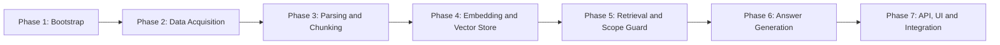

# Implementation Plan: Dietary Guidance RAG Chatbot

> Derived from [ProblemStatement.md](file:///Users/sukesh/Documents/AI%20Projects%20%26%20Learning/Nutrition-RAG/Docs/ProblemStatement.md) and [Architecture.md](file:///Users/sukesh/Documents/AI%20Projects%20%26%20Learning/Nutrition-RAG/Docs/Architecture.md)

---

## Plan Overview

```
Phase 1 ─── Project Bootstrap & Configuration
  │
Phase 2 ─── Data Acquisition & Document Registry
  │
Phase 3 ─── Parsing & Structure-Aware Chunking
  │
Phase 4 ─── Embedding & Vector Store
  │
Phase 5 ─── Retrieval Engine & Scope Guard
  │
Phase 6 ─── Answer Generation & Citation Layer
  │
Phase 7 ─── API, UI & End-to-End Integration
```

> [!NOTE]
> Each phase is designed to be independently testable. A phase is "done" only when every acceptance criterion listed under it passes.

---

## Phase 1 — Project Bootstrap & Configuration

**Goal:** Establish the project skeleton, dependency management, configuration system, and development tooling so every subsequent phase drops into a ready scaffold.

### 1.1 Tasks

| # | Task | Output |
|---|------|--------|
| 1.1 | Create the full directory tree from §10 of the Architecture doc | Folder structure matching the spec |
| 1.2 | Initialize `pyproject.toml` with project metadata and script entrypoints | `pyproject.toml` |
| 1.3 | Create `requirements.txt` with pinned core dependencies | `requirements.txt` |
| 1.4 | Implement `src/config.py` with Pydantic Settings | Type-safe config loading from `.env` |
| 1.5 | Create `.env.example` with all variables from §11.1 | `.env.example` |
| 1.6 | Create `.gitignore` for Python, `.env`, `data/`, `__pycache__` | `.gitignore` |
| 1.7 | Add placeholder `__init__.py` files in every package | Clean Python package imports |
| 1.8 | Write a bare-bones `README.md` with project description and setup instructions | `README.md` |

### 1.2 Key Dependencies to Install

```
# Core
pydantic-settings
python-dotenv

# Ingestion
requests
beautifulsoup4
pymupdf            # PyMuPDF — for PDF extraction
pdfplumber

# Embedding & Vector Store
sentence-transformers
chromadb

# LLM
groq

# API & UI
fastapi
uvicorn[standard]
streamlit

# Testing
pytest
pytest-asyncio
```

### 1.3 Acceptance Criteria

- [ ] `from src.config import Settings` succeeds and loads defaults.
- [ ] `Settings()` with a valid `.env` file returns a populated config object.
- [ ] `python -c "from src.config import Settings; print(Settings().llm_model)"` prints `llama3-70b-8192`.
- [ ] All `__init__.py` files exist; no import errors from any sub-package.
- [ ] `pytest` runs (even with zero tests) and exits cleanly.

---

## Phase 2 — Data Acquisition & Document Registry

**Goal:** Download all 21 corpus documents, store them locally with correct filenames, and build the `corpus_registry.json` that tracks every document's provenance metadata.

### 2.1 Tasks

| # | Task | Output |
|---|------|--------|
| 2.1 | Create `data/corpus_registry.json` with entries for all 21 documents (schema from §3.2) | `corpus_registry.json` |
| 2.2 | Implement `src/ingestion/scraper.py` — functions to download HTML pages and PDF files | `scraper.py` |
| 2.3 | Download all HTML sources → `data/raw/{doc_id}.html` | 15 HTML files |
| 2.4 | Download all PDF sources → `data/raw/{doc_id}.pdf` | 6 PDF files |
| 2.5 | Write `scripts/ingest.py` (CLI entrypoint) — for now, just the scrape step | `ingest.py` |
| 2.6 | Add unit tests for scraper | `tests/test_scraper.py` |

### 2.2 Document ID Mapping

| doc_id | Title | Format |
|--------|-------|--------|
| `who-healthy-diet` | Healthy Diet Fact Sheet | HTML |
| `canada-food-guide` | Canada's Food Guide | PDF |
| `harvard-eating-plate` | Healthy Eating Plate | HTML |
| `nhs-eatwell-guide` | Eat Well Guide | HTML |
| `nhs-balanced-diet` | Balanced Diet Guide | HTML |
| `icmr-dietary-guidelines` | Dietary Guidelines for Indians (2024) | PDF |
| `who-five-keys` | Five Keys to Safer Food Manual | PDF |
| `harvard-kids-plate` | Kids Healthy Eating Plate | HTML |
| `harvard-whole-grains` | Whole Grains | HTML |
| `harvard-protein` | Protein | HTML |
| `harvard-vegetables-fruits` | Vegetables and Fruits | HTML |
| `harvard-healthy-fats` | Healthy Fats | HTML |
| `harvard-dairy` | Milk and Dairy Choices | HTML |
| `harvard-water` | Water | HTML |
| `harvard-sodium` | Sodium | HTML |
| `harvard-sugary-drinks` | Sugar-Sweetened Beverages | HTML |
| `harvard-red-meat` | Limiting Red and Processed Meat | HTML |
| `australia-dietary-guidelines` | Australian Dietary Guidelines | PDF |
| `us-dietary-guidelines` | Dietary Guidelines for Americans | PDF |
| `singapore-healthhub-eat-more` | Eat More (Singapore HealthHub) | HTML |
| `icmr-nin-dietary-guidelines` | Dietary Guidelines for NIN Website | PDF |

### 2.3 Corpus Registry Schema

Each entry in `corpus_registry.json` must include:

```json
{
  "doc_id": "string",
  "title": "string",
  "publisher": "string",
  "year": "integer",
  "source_url": "string (original URL)",
  "retrieval_date": "string (ISO date)",
  "format": "html | pdf",
  "local_path": "data/raw/{doc_id}.{ext}",
  "category": "nutrition | food_safety"
}
```

### 2.4 Acceptance Criteria

- [ ] `data/raw/` contains one file per corpus document (21 files).
- [ ] Every file is non-empty and in the expected format (valid HTML or valid PDF).
- [ ] `corpus_registry.json` is valid JSON with 21 entries.
- [ ] Every registry entry has all 9 required fields populated.
- [ ] `local_path` in each entry resolves to an actual file on disk.
- [ ] `scripts/ingest.py --step scrape` runs end-to-end without error.

---

## Phase 3 — Parsing & Structure-Aware Chunking

**Goal:** Transform raw HTML/PDF files into structured parsed documents, then chunk them using a structure-aware strategy that preserves tables, lists, and section headings.

### 3.1 Tasks

| # | Task | Output |
|---|------|--------|
| 3.1 | Implement `src/ingestion/parser.py` — HTML parser using BS4 | `parser.py` |
| 3.2 | Implement `src/ingestion/parser.py` — PDF parser using PyMuPDF/pdfplumber | Extended `parser.py` |
| 3.3 | Define `ParsedDocument` and `Section` dataclasses (schema from §3.4) | Models in `parser.py` |
| 3.4 | Parse all 21 documents → save as JSON to `data/parsed/{doc_id}.json` | 21 parsed JSON files |
| 3.5 | Implement `src/ingestion/chunker.py` — structure-aware chunking (§4.1) | `chunker.py` |
| 3.6 | Define `Chunk` dataclass with full provenance metadata (§4.3) | Model in `chunker.py` |
| 3.7 | Chunk all parsed documents → save to `data/chunks/{doc_id}_chunks.json` | 21 chunk files |
| 3.8 | Extend `scripts/ingest.py` to include parse + chunk steps | Updated `ingest.py` |
| 3.9 | Write unit tests for parser and chunker | `tests/test_parser.py`, `tests/test_chunker.py` |

### 3.2 Parsing Rules

```
HTML Documents:
  ├── Strip: navbars, footers, cookie banners, sidebars, scripts, styles
  ├── Detect: headings (h1–h6), paragraphs, tables, ordered/unordered lists
  └── Output: list of Section objects with heading, content, section_type

PDF Documents:
  ├── Extract: text blocks preserving reading order
  ├── Detect: table regions (keep as atomic units)
  ├── Detect: section headings by font size/weight heuristics
  └── Output: same Section-based structure as HTML
```

### 3.3 Chunking Algorithm Detail

```
Input: ParsedDocument (list of Sections)

For each Section:
  1. If section_type == "list":
       → Keep as a single atomic chunk (even if > max_chunk_tokens)
       → Attach section_heading as metadata
     If section_type == "table":
       → Use Header-Preserving Row Chunking if > max_chunk_tokens

  2. If section_type == "prose":
       a. Split text into sentences
       b. Accumulate sentences until token_count ≈ max_chunk_tokens (512)
       c. Apply overlap_tokens (50) at boundaries
       d. If accumulated < min_chunk_tokens (50), merge with next chunk

  3. Assign chunk metadata:
       chunk_id = f"{doc_id}__{section_heading_slug}__{chunk_index}"
       Inherit: doc_id, document_name, publisher, year, source_url
       Inject: Breadcrumb metadata directly into content (e.g. `[H1 > H2]\n<content>`)
```

### 3.4 Acceptance Criteria

- [x] `data/parsed/` contains 21 valid JSON files, one per document.
- [x] Each parsed document has at least 1 section with a heading.
- [x] Tables are detected and marked as `section_type: "table"` (spot-check at least 2 documents known to have tables).
- [x] `data/chunks/` contains 21 chunk files.
- [x] No chunk exceeds `max_chunk_tokens` (512) **unless** it is an atomic list.
- [x] No chunk is below `min_chunk_tokens` (50) **unless** it is the only chunk in its section.
- [x] Every chunk has all 10 fields from the Chunk schema populated.
- [x] `chunker.py` unit tests cover: prose splitting, table row chunking, small-chunk merging, and breadcrumb metadata propagation.

---

## Phase 4 — Embedding & Vector Store

**Goal:** Generate embeddings for all chunks and store them in ChromaDB with full metadata, creating the searchable vector index that powers retrieval.

### 4.1 Tasks

| # | Task | Output |
|---|------|--------|
| 4.1 | Implement `src/ingestion/embedder.py` — load model, batch-embed chunks | `embedder.py` |
| 4.2 | Implement `src/retrieval/vector_store.py` — ChromaDB wrapper (§5.1) | `vector_store.py` |
| 4.3 | Create the `dietary_guidance` collection with cosine similarity | ChromaDB collection |
| 4.4 | Embed all chunks and upsert into ChromaDB | Persisted vector store in `data/chroma/` |
| 4.5 | Extend `scripts/ingest.py` with embed + store steps | Updated `ingest.py` |
| 4.6 | Write integration tests | `tests/test_vector_store.py` |

### 4.2 Embedding Details

| Parameter | Value |
|-----------|-------|
| Model | `BAAI/bge-small-en-v1.5` |
| Dimension | 384 |
| Batch size | 64 (tune for memory) |
| Normalize | Yes (cosine similarity) |

### 4.3 ChromaDB Collection Schema

```python
collection.add(
    ids       = [chunk.chunk_id, ...],
    documents = [chunk.content, ...],
    embeddings= [vector, ...],
    metadatas = [{
        "doc_id":           chunk.doc_id,
        "document_name":    chunk.document_name,
        "publisher":        chunk.publisher,
        "year":             chunk.year,
        "section_heading":  chunk.section_heading,
        "source_url":       chunk.source_url,
        "chunk_index":      chunk.chunk_index,
        "token_count":      chunk.token_count
    }, ...]
)
```

### 4.4 Acceptance Criteria

- [ ] `embedder.py` can embed a list of strings and return a list of 384-dim float vectors.
- [ ] ChromaDB persists to `data/chroma/` and survives process restarts.
- [ ] `collection.count()` equals total number of chunks produced in Phase 3.
- [ ] A simple query like `"healthy diet recommendations"` returns results with non-zero similarity scores.
- [ ] Metadata filtering works: querying with `where={"doc_id": "who-healthy-diet"}` returns only WHO chunks.
- [ ] `scripts/ingest.py --step all` runs the full pipeline (scrape → parse → chunk → embed → store) end-to-end.

---

## Phase 5 — Retrieval Engine & Scope Guard

**Goal:** Build the query-time retrieval logic (vector search, document filtering, cross-document grouping) and the two-layer refusal system (blocklist + relevance threshold).

### 5.1 Tasks

| # | Task | Output |
|---|------|--------|
| 5.1 | Implement `src/retrieval/retriever.py` — query, filter, group results (§6) | `retriever.py` |
| 5.2 | Add document-filtered retrieval: `where={"doc_id": ...}` and `where={"publisher": ...}` | Filtered search in `retriever.py` |
| 5.3 | Implement `group_by_document()` for cross-document answers (§6.4) | Grouping logic in `retriever.py` |
| 5.4 | Implement `src/guardrails/scope_guard.py` — blocklist + keyword detection (§8.2) | `scope_guard.py` |
| 5.5 | Implement `src/guardrails/relevance_check.py` — similarity threshold check (§8.1) | `relevance_check.py` |
| 5.6 | Write tests for retriever, scope guard, and relevance check | `tests/test_retriever.py`, `tests/test_scope_guard.py` |

### 5.2 Retrieval Parameters

| Parameter | Default | Purpose |
|-----------|---------|---------|
| `fetch_k` | 30 | Oversample pool size to ensure cross-document diversity |
| `top_k` | 10 | Max total chunks finally passed to LLM |
| `distance_threshold` | 0.40 | Above this → "not in corpus" refusal |
| `max_docs_in_answer` | 3 | Cap on distinct documents in one answer |
| `max_chunks_per_doc`| 4 | Cap on chunks drawn from a single document to prevent dominance |

### 5.3 Scope Guard: Blocked Topics

```python
BLOCKED_TOPICS = [
    "medical advice", "diagnos", "prescri", "medication",
    "calorie target", "calorie goal", "weight loss", "lose weight",
    "BMI", "body mass index", "how much should I weigh",
    "diet plan for weight", "eating disorder"
]
```

### 5.4 Refusal Decision Tree

```
Query arrives
  │
  ├── contains BLOCKED_TOPIC? ──► YES → Return out-of-scope refusal
  │                                      "This falls outside what I can help with.
  │                                       Please consult a qualified healthcare professional."
  │
  └── NO → Run vector search
             │
             ├── min_distance > 0.40? ──► YES → Return corpus refusal
             │                                    "The dietary guidance documents I searched
             │                                     do not cover this topic.
             │                                     I searched: [doc_list]"
             │
             └── NO → Proceed to answer generation
```

### 5.5 Acceptance Criteria

- [ ] `retriever.query("salt intake")` returns top-k chunks with similarity scores.
- [ ] `retriever.query("salt", filter_doc="who-healthy-diet")` returns only WHO chunks.
- [ ] `retriever.query("cooking oil safety")` returns chunks from multiple documents, correctly grouped by `doc_id`.
- [ ] `is_out_of_scope("Should I take vitamin D supplements?")` returns `True`.
- [ ] `is_out_of_scope("How long can I keep chicken in the fridge?")` returns `False`.
- [ ] `is_out_of_scope("What should I weigh for my height?")` returns `True`.
- [ ] Relevance check correctly refuses when all retrieved chunks have a distance above 0.40.
- [ ] Edge case: empty query string is handled gracefully.

---

## Phase 6 — Answer Generation & Citation Layer

**Goal:** Wire up the LLM (Groq), build the prompt construction pipeline, implement citation formatting, and assemble the orchestrator that ties scope check → retrieve → generate into a single pipeline.

### 6.1 Tasks

| # | Task | Output |
|---|------|--------|
| 6.1 | Implement `src/generation/llm_client.py` — Groq API wrapper | `llm_client.py` |
| 6.2 | Implement `src/generation/prompt_builder.py` — construct prompts with system instructions, grouped context, and user query (§7.2) | `prompt_builder.py` |
| 6.3 | Implement `src/generation/citation_builder.py` — format inline citations from chunk metadata (§7.3) | `citation_builder.py` |
| 6.4 | Implement `src/orchestrator.py` — full pipeline: scope check → retrieve → relevance check → group → build prompt → generate → attach citations (§12) | `orchestrator.py` |
| 6.5 | Write unit tests for prompt builder and citation builder | `tests/test_prompt_builder.py`, `tests/test_citation_builder.py` |
| 6.6 | Write integration test for orchestrator | `tests/test_orchestrator.py` |

### 6.2 System Prompt (from §7.1)

```
You are a dietary guidance assistant. You answer questions about food,
nutrition, and food safety using ONLY the provided reference chunks.

RULES:
1. Answer ONLY from the provided chunks. Do not use prior knowledge.
2. Cite every claim with [Document Name, Publisher, Year](source_url).
3. When chunks from multiple documents are relevant, provide SEPARATE
   answers per document. NEVER blend sources into a single claim.
4. If the provided chunks do not contain the answer, say:
   "The dietary guidance documents I searched do not cover this topic.
    I searched: {list of documents searched}."
5. NEVER provide medical advice, calorie targets, weight-loss plans,
   or body-weight recommendations. If asked, respond:
   "This falls outside what I can help with. Please consult a
    qualified healthcare professional."
```

### 6.3 Prompt Structure

```
┌─────────────────────────────────────────────┐
│              Final Prompt                    │
│                                              │
│  [System Prompt]                            │
│                                              │
│  --- Retrieved Context ---                  │
│  Source 1: {doc_name} ({publisher}, {year})  │
│  URL: {source_url}                           │
│  > {chunk_content}                          │
│                                              │
│  Source 2: {doc_name} ({publisher}, {year})  │
│  URL: {source_url}                           │
│  > {chunk_content}                          │
│  ...                                         │
│                                              │
│  --- User Question ---                      │
│  {user_query}                               │
└─────────────────────────────────────────────┘
```

### 6.4 Citation Format

Every answer includes inline citations in this format:

```
[Document Name, Publisher, Year](source_url)
```

**Example:**

```
According to the WHO, a healthy diet includes at least 400g of fruits
and vegetables per day [Healthy Diet Fact Sheet, WHO, 2024](https://www.who.int/...).
```

### 6.5 Orchestrator Flow

```python
async def answer(query: str, filter_document: str | None = None) -> ChatResponse:
    # 1. Scope check
    if is_out_of_scope(query):
        return ChatResponse(refusal_type="out_of_scope", ...)

    # 2. Retrieve
    results = retriever.query(query, filter_doc=filter_document, top_k=settings.top_k)

    # 3. Relevance check
    if min_distance(results) > settings.distance_threshold:
        return ChatResponse(refusal_type="not_in_corpus", ...)

    # 4. Group by document
    grouped = group_by_document(results)

    # 5. Build prompt
    prompt = prompt_builder.build(query, grouped)

    # 6. Generate
    raw_answer = await llm_client.generate(prompt)

    # 7. Build citations
    citations = citation_builder.build(grouped)

    return ChatResponse(answer=raw_answer, citations=citations, ...)
```

### 6.6 Acceptance Criteria

- [x] `llm_client.generate(prompt)` returns a non-empty string response from Groq.
- [x] `prompt_builder.build(query, grouped_chunks)` produces a prompt containing the system instructions, all chunk contents with metadata, and the user query.
- [x] `citation_builder.build(grouped_chunks)` returns a list of citation objects with all 4 required fields (document_name, publisher, year, source_url).
- [x] Orchestrator returns correct answer for `"What does WHO recommend for daily salt intake?"`.
- [x] Orchestrator returns out-of-scope refusal for `"How many calories should I eat to lose weight?"`.
- [x] Orchestrator returns corpus refusal for `"What is the capital of France?"`.
- [x] Cross-document question: `"Tell me about cooking oil"` returns **separate** answers per document, not a blended response.
- [x] Every claim in the answer carries an inline citation.

---

## Phase 7 — API, UI & End-to-End Integration

**Goal:** Expose the chatbot through a FastAPI REST API and a Streamlit chat UI. Run full end-to-end tests and polish for demo readiness.

### 7.1 Tasks

| # | Task | Output |
|---|------|--------|
| 7.1 | Implement `src/api/schemas.py` — Pydantic request/response models (§9.2) | `schemas.py` |
| 7.2 | Implement `src/api/routes.py` — endpoint definitions (§9.1) | `routes.py` |
| 7.3 | Implement `src/api/main.py` — FastAPI app with CORS, lifespan events | `main.py` |
| 7.4 | Implement `ui/app.py` — Streamlit chat interface | `app.py` |
| 7.5 | Write end-to-end API tests | `tests/test_e2e.py` |
| 7.6 | Create `Dockerfile` and `docker-compose.yml` (§14.2) | Docker files |
| 7.7 | Finalize `README.md` with full setup, usage, and chunking strategy documentation | `README.md` |

### 7.2 API Endpoints

| Method | Endpoint | Description |
|--------|----------|-------------|
| `POST` | `/api/v1/chat` | Send a query, get an answer with citations |
| `GET` | `/api/v1/documents` | List all documents in the corpus |
| `GET` | `/api/v1/documents/{doc_id}` | Get metadata for a specific document |
| `POST` | `/api/v1/ingest` | Trigger re-ingestion of the corpus (admin) |
| `GET` | `/api/v1/health` | Health check |

### 7.3 Chat API Schemas

**Request:**

```json
{
  "query": "What does the WHO recommend for daily salt intake?",
  "filter_document": null,
  "top_k": 10
}
```

**Response:**

```json
{
  "answer": "According to the WHO, adults should consume less than 5g of salt per day...",
  "citations": [
    {
      "document_name": "Healthy Diet Fact Sheet",
      "publisher": "WHO",
      "year": 2024,
      "source_url": "https://www.who.int/...",
      "chunk_excerpt": "Adults should consume less than 5 g of salt..."
    }
  ],
  "documents_searched": ["who-healthy-diet", "nhs-eatwell-guide"],
  "refusal_type": null
}
```

### 7.4 Streamlit UI Requirements

- Chat-style interface with message history
- Display answers with formatted inline citations (clickable links)
- Sidebar: document filter dropdown (select a specific source or "All Documents")
- Sidebar: display corpus document list with metadata
- Visual distinction between user messages and assistant responses
- Refusal messages displayed with appropriate styling

### 7.5 Acceptance Criteria

- [ ] `POST /api/v1/chat` with a valid query returns 200 with answer + citations.
- [ ] `POST /api/v1/chat` with a blocked query returns 200 with `refusal_type: "out_of_scope"`.
- [ ] `GET /api/v1/documents` returns the full corpus registry (21 documents).
- [ ] `GET /api/v1/documents/who-healthy-diet` returns correct metadata.
- [ ] `GET /api/v1/health` returns 200.
- [ ] Streamlit UI loads, accepts a query, and displays the answer with citations.
- [ ] Document filter in the UI correctly restricts retrieval to the selected document.
- [ ] `docker-compose up` starts API + UI + vector store successfully.
- [ ] End-to-end tests pass for all 5 query categories: nutrition question, food safety question, cross-document question, out-of-scope refusal, corpus refusal.

---

## Phase Dependencies



> [!IMPORTANT]
> Phases are **strictly sequential** — each phase depends on the artifacts of the previous one. However, `scope_guard.py` (Phase 5) and `citation_builder.py` (Phase 6) are pure-logic modules with no upstream dependencies and can be developed in parallel with earlier phases if needed.

---

## Testing Pyramid

| Level | Phase | Tests |
|-------|-------|-------|
| **Unit** | 1 | Config loading |
| **Unit** | 2 | Scraper downloads |
| **Unit** | 3 | Parser structure detection, chunker splitting logic |
| **Unit** | 4 | Embedder vector dimensions |
| **Unit** | 5 | Scope guard blocklist, relevance threshold |
| **Unit** | 6 | Prompt builder output, citation formatting |
| **Integration** | 4 | ChromaDB CRUD + metadata filtering |
| **Integration** | 5 | Retriever ↔ vector store query flow |
| **Integration** | 6 | Orchestrator pipeline (mock LLM) |
| **E2E** | 7 | Full API tests, UI smoke test |
| **Regression** | 7 | Golden Q&A pairs (20+ curated pairs) |

---

## Golden Test Cases (for Regression in Phase 7)

These 10 representative queries should produce stable, correct answers:

| # | Query | Expected Behavior |
|---|-------|-------------------|
| 1 | "What does the WHO recommend for daily salt intake?" | Answer from WHO doc with citation |
| 2 | "How long can I keep cooked food in the fridge?" | Answer from food safety docs with citation |
| 3 | "What are the five keys to safer food?" | Answer from WHO Five Keys doc |
| 4 | "Tell me about healthy fats" | Cross-doc answer (Harvard + others), separate citations |
| 5 | "What does the NHS say about eating fruit?" | Filtered to NHS docs only |
| 6 | "Should I take vitamin D supplements?" | Out-of-scope refusal (medical advice) |
| 7 | "How many calories should I eat to lose weight?" | Out-of-scope refusal (weight/calorie target) |
| 8 | "What is the capital of France?" | Corpus refusal (not covered) |
| 9 | "Is cooking oil safe?" | Cross-doc answer (nutrition + food safety perspectives) |
| 10 | "What temperature should I cook chicken to?" | Answer from food safety docs |

---

## Risk Register

| Risk | Impact | Mitigation |
|------|--------|------------|
| **PDF parsing fails** — some PDFs have complex layouts or are scanned images | Chunks are incomplete or garbled | Use `pdfplumber` for table extraction; fall back to `PyMuPDF` for text; manually verify parsed output |
| **URL becomes unavailable** — a source website goes down or changes structure | Cannot download document | Store all raw files in `data/raw/` at scrape time; include `retrieval_date` in registry |
| **Groq rate limits** — free tier has request limits | Answer generation fails under load | Implement retry with exponential backoff; cache responses for identical queries |
| **Chunking destroys tables** — structure-aware chunker misdetects table boundaries | Poor retrieval quality for table data | Unit test with known table documents; keep tables atomic |
| **Embedding model quality** — bge-small-en-v1.5 may not capture all domain nuances | Low retrieval recall | Monitor similarity scores; architecture supports swapping to a larger model |
| **Scope guard over-blocks** — keyword matching is too aggressive | Legitimate nutrition questions get refused | Test with edge cases; keep blocklist focused; log refused queries for review |

---

> **Document Version:** 1.0
> **Last Updated:** 2026-09-29
> **Status:** Draft — ready for review
